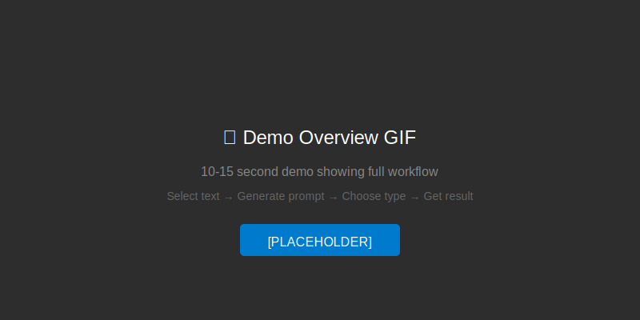
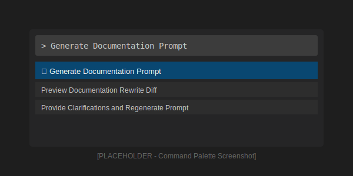
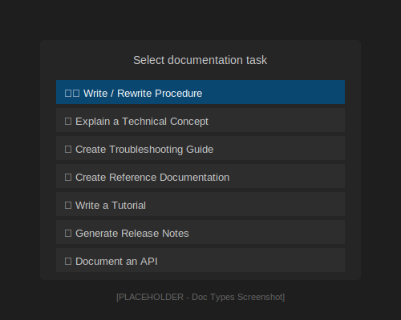
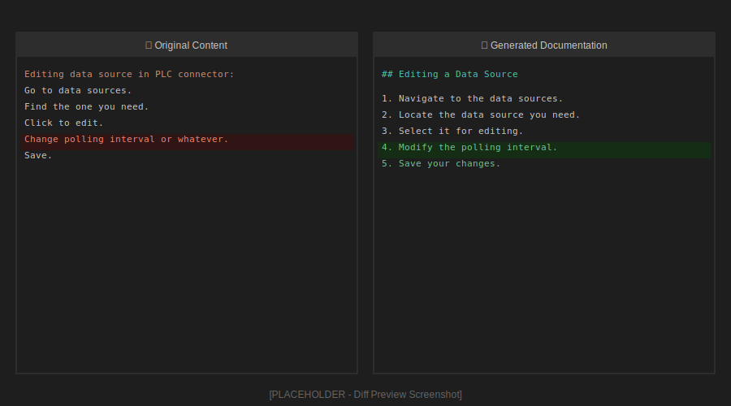

# Documentation Agent Orchestrator

> **Make AI write accurate documentation - not creative fiction**

A VS Code extension that prevents AI from inventing features when writing technical documentation. It keeps AI honest by forcing it to document only what's actually there.


*↑ See how the extension prevents AI from inventing features*

---

## 📖 Table of Contents

- [The Problem](#-the-problem-ai-invents-too-much)
- [The Solution](#-the-solution-governed-ai)
- [How It Works](#-how-it-works-in-3-steps)
- [Quick Start Guide](#-quick-start-in-5-minutes)
- [Real Examples](#-see-it-in-action)
- [Commands](#-available-commands)
- [Who Should Use This](#-who-is-this-for)
- [Installation](#-installation)

---

## 🚨 The Problem: AI Invents Too Much

When you ask AI (like ChatGPT or Claude) to turn your rough notes into documentation, it tries to be "helpful" by:

❌ **Adding features you never mentioned**  
❌ **Inventing button labels and error messages**  
❌ **Creating steps that don't exist**  
❌ **Changing your technical terms**  
❌ **Making assumptions about how things work**

**The result?** Documentation that *looks* professional but describes a product that doesn't exist.

### Real Example of the Problem

**Your notes:**
```
User clicks login. System checks credentials.
Valid → dashboard. Invalid → error.
```

**What normal AI does:**
```markdown
1. Click the "Sign In" button (blue, bottom right)
2. Enter username (required, email format)
3. Enter password (minimum 8 characters)
4. Click "Submit"
5. System validates against database
6. On success: Redirect to /dashboard with welcome message
7. On failure: Display red error "Invalid credentials. Try again." 
8. After 3 attempts, account locks for 15 minutes
```

**The problem:** AI invented button labels, colors, field requirements, URLs, error text, and a lockout policy that may not exist!

---

## ✅ The Solution: Governed AI

This extension adds a "governance layer" between your notes and AI. It forces AI to:

✅ **Document only what you provided**  
✅ **Preserve vague details as-is** (not invent specifics)  
✅ **List ambiguities explicitly** (so you know what's unclear)  
✅ **Ask questions only when absolutely necessary**  


*↑ Without governance vs. With governance*

---

## 🎯 How It Works (In 3 Steps)

### Step 1: You Select Content
Pick any rough notes, code comments, Jira tickets, or incomplete docs in VS Code.

*Screenshot: Text selection in VS Code (coming soon)*

### Step 2: Extension Creates Special Prompt
The extension generates a prompt with built-in rules that prevent AI from inventing details.

*Screenshot: Generated prompt (coming soon)*

### Step 3: AI Creates Accurate Docs
Paste the prompt into ChatGPT/Claude. AI writes documentation that's accurate to your source.

*Screenshot: AI response (coming soon)*

---

## 🚀 Quick Start (In 5 Minutes)

### 1️⃣ Open Your Notes in VS Code

Any rough notes work:
- Meeting notes
- Slack messages  
- Code comments
- Jira tickets
- Email threads

### 2️⃣ Select the Text

Highlight the content you want to document, or just open the file.

### 3️⃣ Run the Command

- Press **Ctrl+Shift+P** (or **Cmd+Shift+P** on Mac)
- Type: `Generate Documentation Prompt`
- Press Enter



### 4️⃣ Choose Documentation Type

Pick what you're creating:

| Type | When to Use |
|------|------------|
| **Procedure** | Step-by-step instructions (how to do something) |
| **Concept** | Explanations (how something works) |
| **Troubleshooting** | Problem-solving guides (how to fix issues) |
| **Reference** | Configuration docs, command lists |
| **Tutorial** | Learning guides (hands-on teaching) |
| **Release Notes** | Version updates and changes |
| **API Documentation** | Endpoint and function docs |



### 5️⃣ Describe What You Want

In one sentence, tell the extension what you're documenting:
- "Document the login process"
- "Explain how caching works"
- "Troubleshoot deployment errors"

### 6️⃣ Get Your Prompt

The extension:
- ✅ Creates a special prompt with governance rules
- ✅ Automatically copies it to your clipboard  
- ✅ Opens it in a new tab so you can review it


### 7️⃣ Paste Into AI

Open ChatGPT, Claude, or any AI assistant and paste the prompt. The AI will respond with either:

- **📄 Structured documentation** (if your notes have enough detail)
- **❓ Clarifying questions** (if critical info is missing)


### 8️⃣ Review the Results (Optional)

Want to see what changed?

1. Copy the AI's response
2. Press **Ctrl+Shift+P**
3. Run: `Preview Documentation Rewrite Diff`
4. See a side-by-side comparison



**That's it!** You now have accurate documentation.

---

## 📊 See It In Action

### Example 1: Vague Notes → Accurate Docs

**Your rough notes:**
```
Go to data sources.
Find the one you need.
Click to edit.
Change polling interval or whatever.
Save.
```

**❌ What normal AI invents:**
```markdown
1. Navigate to Settings > Data Sources menu
2. Use the search bar to filter sources (supports wildcards)
3. Double-click the data source name or click "Edit" button
4. In the Properties dialog, change "Polling Interval" field
   - Min: 100ms, Max: 60000ms
   - Recommended: 1000ms for most applications
5. Click "OK" to save
6. Restart the service for changes to take effect
```
*Invented: menu paths, search features, UI element types, value ranges, recommendations, restart requirement*

**✅ What governed AI creates:**
```markdown
## Editing a Data Source

1. Navigate to the data sources.
2. Locate the data source you need.
3. Select it for editing.
4. Modify the polling interval.
5. Save your changes.

### Preserved Ambiguities
- Navigation method not specified
- Selection/editing mechanism not defined
- Polling interval units not mentioned
- Save method not detailed
- Post-save actions not described
```
*Documented only what was provided. Listed what's unclear.*

---

### Example 2: Complete Notes → Perfect Docs

**Your detailed notes:**
```
The homepage displays a login form with username 
and password fields. When user clicks the blue 
"Sign In" button, the system validates credentials. 
Valid users redirect to /dashboard with welcome message.
Invalid users see red error: "Invalid credentials."
```

**✅ What governed AI creates:**
```markdown
## User Login Process

### Procedure

1. The homepage displays a login form with username and password fields.
2. Click the blue "Sign In" button. The system validates your credentials.
3. If credentials are valid, you are redirected to /dashboard. A welcome message is displayed.
4. If credentials are invalid, a red error message is displayed: "Invalid credentials."

### Notes
- Login form appears on the homepage
- Button color: blue
- Button label: "Sign In"
- Error message color: red
- Dashboard URL: /dashboard
```
*Uses exact terms, colors, messages from your notes. Nothing invented.*

---

### Example 3: When AI Asks Questions

**Your incomplete notes:**
```
User completes the standard workflow.
System takes appropriate action.
```

**What governed AI does:**
```markdown
## MISSING INFORMATION

I cannot generate documentation because the source contains undefined references:

**Questions:**

1. What is "standard workflow"?
   - What specific steps does it include?
   - Where is this workflow defined?

2. What is "appropriate action"?
   - Does it redirect somewhere?
   - Display a message?
   - Update data?
   - Trigger a process?

Please provide these details to continue.
```
*AI stops and asks instead of inventing. You provide answers, then regenerate.*

---

## 🛠 Available Commands

### 1. Generate Documentation Prompt
**What it does:** Creates a special AI prompt from your notes  
**When to use:** Every time you want to document something  
**How to run:**  
- Press `Ctrl+Shift+P` (or `Cmd+Shift+P`)
- Type: `Generate Documentation Prompt`


---

### 2. Preview Documentation Rewrite Diff
**What it does:** Shows before/after comparison of your docs  
**When to use:** When you want to see what AI changed  
**How to run:**  
- Press `Ctrl+Shift+P`
- Type: `Preview Documentation Rewrite Diff`


---

### 3. Provide Clarifications and Regenerate Prompt
**What it does:** Answer AI's questions and create new prompt  
**When to use:** When AI asked you questions  
**How to run:**  
- Press `Ctrl+Shift+P`
- Type: `Provide Clarifications`


---

## 🎨 Understanding the Output

### Every AI response includes:

#### 1. **Main Documentation**
The actual procedure, concept, or troubleshooting guide based on what you provided.

#### 2. **Preserved Ambiguities Section**
A clear list of what was vague in your notes:

```markdown
## Preserved Ambiguities
- "Login button" - specific label not provided
- "Error message" - exact text not specified
- "Dashboard" - URL/path not mentioned
- "Extra options" - admin features not detailed
```

This helps you know what needs clarification.

#### 3. **Notes Section** (if applicable)
Additional context or important details that don't fit elsewhere.

---

## 👥 Who Is This For?

### ✅ Perfect For:

- **Technical Writers** - Need accurate docs from engineering notes
- **Documentation Engineers** - Maintain large doc sets
- **Product Managers** - Turn specs into user guides
- **Developers** - Document APIs and procedures quickly
- **QA Teams** - Create test procedures from bug reports
- **Anyone accountable for doc accuracy**

### ❌ Not For:

- **Creative writing** - This enforces accuracy, not style
- **Marketing content** - Use regular AI for persuasive copy
- **Polishing existing docs** - This doesn't improve writing
- **When you want AI to "fill in gaps"** - This explicitly won't

---

## 💡 Tips for Best Results

### ✅ Do This:

1. **Include specific terms** you want preserved
   - ✅ "blue Sign In button"
   - ❌ "login button"

2. **Mention exact error messages** if you know them
   - ✅ Error: "Invalid credentials. Try again."
   - ❌ Shows error

3. **Provide technical details** when you have them
   - ✅ Redirect to /dashboard
   - ❌ Go to dashboard

4. **Keep your rough notes** - don't clean them up first
   - The extension handles messy input

### ❌ Don't Worry About:

- ❌ Perfect grammar or formatting
- ❌ Complete sentences
- ❌ Filling in details you don't know
- ❌ Organizing before you start

**The extension is designed for rough notes.**

---

## 🔧 Requirements

- **VS Code:** Version 1.104.0 or later
- **AI Assistant:** ChatGPT, Claude, Copilot, or any AI chat tool
- **Internet:** To access AI (the extension itself works offline)

---

## 📥 Installation

### From VS Code Marketplace:

1. Open VS Code
2. Click Extensions icon (or press `Ctrl+Shift+X`)
3. Search for: `Documentation Agent Orchestrator`
4. Click **Install**

### From Command Line:

```bash
code --install-extension TharunSebastian.doc-agent-orchestrator
```

### Manual Installation:

1. Download the `.vsix` file from [GitHub Releases](https://github.com/Tharun135/doc-agent-orchestrator/releases)
2. In VS Code: Extensions → ⋯ (More Actions) → Install from VSIX

---

## 🤔 FAQ

<details>
<summary><strong>Q: Do I need perfect input?</strong></summary>

**A:** No! The extension handles vague, messy notes. It preserves ambiguity instead of inventing details.
</details>

<details>
<summary><strong>Q: Will AI invent features?</strong></summary>

**A:** No. The governance rules prevent AI from adding anything not in your notes.
</details>

<details>
<summary><strong>Q: What if I don't know all the details?</strong></summary>

**A:** That's fine! AI will either:
- Document what you provided (preserving the vagueness), OR
- Ask you specific questions about what's missing
</details>

<details>
<summary><strong>Q: Can I use this with any AI?</strong></summary>

**A:** Yes! Works with ChatGPT, Claude, Copilot, or any AI assistant that accepts prompts.
</details>

<details>
<summary><strong>Q: Does it improve my writing?</strong></summary>

**A:** No, that's not the goal. This extension focuses on **accuracy**, not style. It won't polish sentences or make things sound better.
</details>

<details>
<summary><strong>Q: Do I need an API key?</strong></summary>

**A:** No! The extension just creates prompts. You manually paste them into whatever AI tool you already use.
</details>

<details>
<summary><strong>Q: Is my content sent to any servers?</strong></summary>

**A:** No. The extension works entirely offline. Your notes only leave VS Code when you manually paste them into AI.
</details>

---

## 🎬 Video Tutorials

### Getting Started (2 min)


### Handling Ambiguous Notes (3 min)


### Using the Diff Preview (1 min)


---

## 🆚 Comparison: Normal AI vs. Governed AI

| Feature | Normal AI | Governed AI (This Extension) |
|---------|-----------|------------------------------|
| **Invents features** | ✅ Yes (helpful!) | ❌ No (accurate!) |
| **Changes terminology** | ✅ "Improves" it | ❌ Uses your exact terms |
| **Fills gaps** | ✅ Makes assumptions | ❌ Lists ambiguities |
| **Error messages** | ✅ Invents text | ❌ Only uses what you provided |
| **UI elements** | ✅ Invents labels | ❌ Preserves vague descriptions |
| **Asks questions** | ❌ Rarely | ✅ When truly needed |
| **Transparency** | ❌ Hidden assumptions | ✅ Explicit "Preserved Ambiguities" section |

---

## 🐛 Troubleshooting

### Problem: "No active editor found"
**Solution:** Open a file in VS Code before running the command.

### Problem: "No rewrite context found"
**Solution:** Run "Generate Documentation Prompt" first, then preview the diff.

### Problem: AI didn't follow the rules
**Solution:** 
- Try Claude or GPT-4 (better instruction following)
- Copy and paste the prompt again
- Check if AI documented violations in "Governance Notes"

### Problem: Extension commands not visible
**Solution:** 
- Check if extension is installed (Extensions panel)
- Reload VS Code
- Make sure VS Code is version 1.104.0+

---

## 🤝 Contributing

Found a bug? Have a feature idea? Want to improve this extension?

- **Report Issues:** [GitHub Issues](https://github.com/Tharun135/doc-agent-orchestrator/issues)
- **Suggest Features:** [GitHub Discussions](https://github.com/Tharun135/doc-agent-orchestrator/discussions)
- **Contribute Code:** [Pull Requests Welcome](https://github.com/Tharun135/doc-agent-orchestrator/pulls)

---

## 📚 Additional Resources

- **📖 Getting Started Guide:** [Full tutorial with examples](./GETTING-STARTED.md)
- **🔧 Technical Documentation:** [For developers and advanced users](./TECHNICAL-DOCUMENTATION.md)
- **🧪 Testing Framework:** [See how we validate governance](./TESTING/README.md)
- **🎯 Demo Guide:** [Perfect for presentations](./DEMO/DEMO-GUIDE.md)
- **📘 Online Documentation:** [GitBook Guide](https://tharun.gitbook.io/documentation-agent-orchestrator/)

---

## 📄 License

MIT License - See [LICENSE](./LICENSE) for details

---

## ⭐ Support This Project

If this extension saves you time and improves your documentation:

- ⭐ Star the repo on [GitHub](https://github.com/Tharun135/doc-agent-orchestrator)
- 📝 Leave a review on [VS Code Marketplace](https://marketplace.visualstudio.com/items?itemName=TharunSebastian.doc-agent-orchestrator)
- 🐦 Share with your team
- 💡 Contribute improvements

---

## 🙏 Acknowledgments

Built with the VS Code Extension API and inspired by the need for trustworthy AI-generated documentation in enterprise environments.

---

**Made with ❤️ for technical writers who value accuracy over eloquence**

