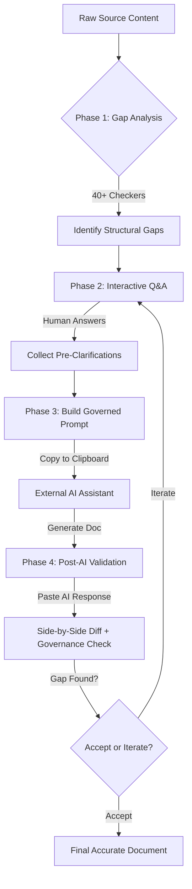

# Workflow of Documentation Agent Orchestrator

This document providing a detailed breakdown of the end-to-end workflow within the **Documentation Agent Orchestrator**. It explains how the system transforms rough, ambiguous source content into governed, accurate technical documentation by enforcing a strict "Analyze → Question → Generate" pipeline.

---

## 1. High-Level Workflow Overview

The orchestrator operates as a governance layer between your raw notes and an AI assistant (like Claude or ChatGPT). Unlike standard writing tools, it prioritizes **accuracy over fluency** and **truth over speed**.

---

## 2. Phase 1: Pre-AI Structural Analysis

Before any content is sent to an AI, the orchestrator scans the source for **structural documentation risks**. These are patterns in the text that historically cause AI to "hallucinate" or invent details to fill gaps.

### The 40-Checker Engine
The system runs 40 per-line checkers and 2 global checkers. These checkers look for:
- **Location Ambiguity**: Steps like "Click the button" without saying *where* the button is.
- **Actor Ambiguity**: Passive voice like "The file is uploaded" without saying *who* or *what* uploads it.
- **Value/Unit Gaps**: "Set timeout to 30" without units (seconds? ms?).
- **Branch Logic Gaps**: "If error, check logs" without specifying *which* logs or *what* to do next.
- **Navigation Gaps**: "Go to Settings" without a full path (e.g., `Admin > System > Settings`).

### Zero-Invention Philosophy
The engine's goal is to ensure the AI never has to guess. It identifies "ASK-level" gaps (blocking actions) and "PRESERVE-level" gaps (non-blocking vagueness).

---

## 3. Phase 2: Interactive Clarification (Q&A)

For every "ASK-level" gap detected in Phase 1, the orchestrator opens a VS Code input box. 

1. **Targeted Questions**: You are asked specific questions based on the gap type (e.g., *"Where in the UI does the user perform 'Upload files'?"*).
2. **Authoritative Facts**: Your answers are captured as **Pre-Clarifications**.
3. **No AI Involvement**: This stage is purely human-driven. It ensures that any "new" information enters the process through a subject-matter expert, not an AI model.

> [!TIP]
> You can "Skip" questions if you want the AI to handle the ambiguity. Skipped questions are passed to the AI with instructions to document them under **Preserved Ambiguities** rather than inventing an answer.

---

## 4. Phase 3: Governed Prompt Generation

Once all questions are answered (or skipped), the orchestrator constructs a "Governed Prompt."

### Anatomy of a Governed Prompt
A typical prompt generated by the extension includes:
- **Immutable Governance Rules**: "Do not invent features," "Do not change terminology," etc.
- **Pre-Clarifications**: Your answers from Phase 2, marked as **authoritative facts**.
- **Source Content**: Your original text, marked as the primary source of truth.
- **Structural Templates**: Predefined layouts for Procedures, Concepts, or Troubleshooting guides.

### The AI Interaction
1. The prompt is automatically copied to your clipboard.
2. You paste the prompt into Claude, ChatGPT, or your preferred LLM.
3. The AI follows the strict governance instructions to reorganize and format your content without adding any unsupported facts.

---

## 5. Phase 4: Post-AI Validation

The workflow doesn't end with the AI response. To ensure governance was followed, the orchestrator provides a validation stage.

### The "Paste & Check" Automation
Using the `Paste AI Response and Run Governance Check` command:
1. **One-Click Setup**: The extension reads the AI response from your clipboard.
2. **Side-by-Side Diff**: It opens a diff view with your **Original Source** on the left and the **AI Document** on the right.
3. **Governance Highlights**: Successful governance and potential issues are surfaced for review.

### Verification Checklist
- **Preserved Ambiguities**: Check this section of the AI output to see what the AI flagged as unclear.
- **Terminology Check**: Ensure "Refresh Token Rotation" wasn't flattened to "Token Refresh."
- **Empty Sections**: Verify that sections like "Prerequisites" are omitted if the source provided no info, rather than filled with "None" or guesses.

---

## 6. The Iterative Feedback Loop

If the AI identifies **Clarifying Questions** in its output or if the **Preserved Ambiguities** are too many, the orchestrator supports a seamless iteration loop.

1. Run **Provide Clarifications and Regenerate**.
2. Answer the AI's specific questions.
3. A new prompt is generated, injecting these new answers as "Phase 2 Clarifications."
4. Repeat until the document is complete and accurate.

---

## Summary: Governance vs. Generative Mode

The extension enforces **Governance Mode**, which differs from standard AI writing.

| Feature | Governance Mode (Extension) | Generative Mode (Direct AI) |
|---|---|---|
| **Primary Goal** | Defensibility & Accuracy | Speed & Fluency |
| **Missing UI Path** | **Ask** the user before generating | **Infer** a typical path |
| **Unspecified Unit** | **Ask** for the unit | **Assume** (e.g., seconds) |
| **Vague Actions** | **Preserve** as "Ambiguity" | **Expand** with plausible steps |
| **Output Quality** | Compliance-grade | Productivity-grade |

---
*© 2026 Documentation Agent Orchestrator Team*
